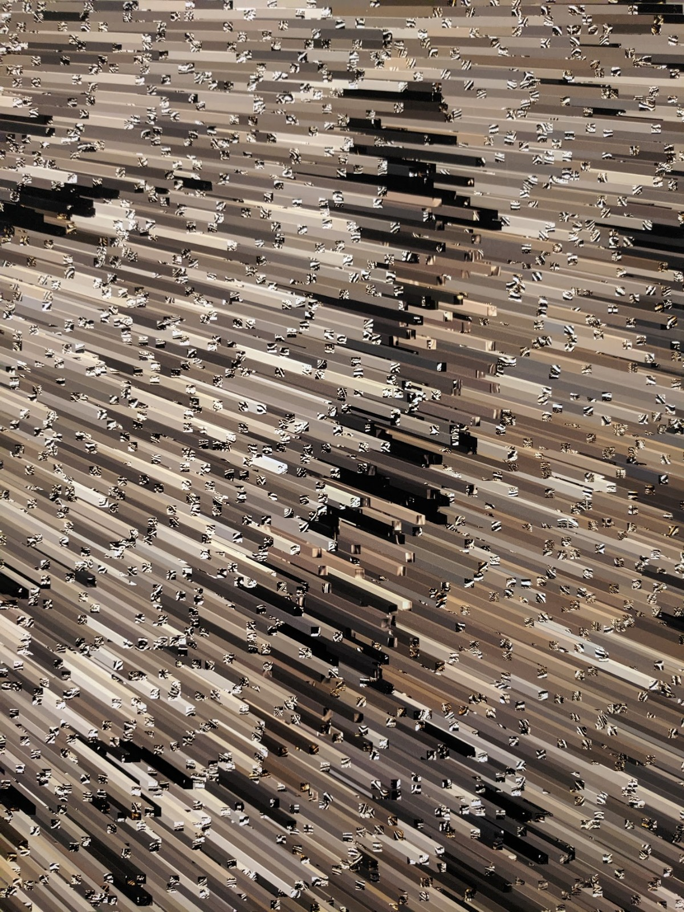
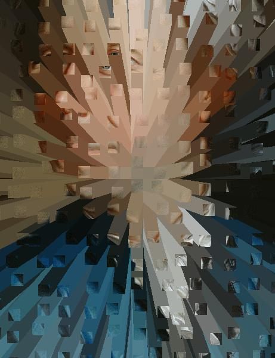

  
  

  
  

- Right now, the vector field is just proportional to the distance from the image center.
- However, if you simply do this (see imgs/vector fields below), the trails overlap each other a lot. Therefore, I added a small amount of random jitter to the vector field. The amount of jitter is proportional to the image dimensions.
- A few more steps. For ex, because all the blocks move outwards, it's effectively only doing it for the center of the image. It'd be smart to add an empty border for them to move to.

Some examples of images and vector fields:

  
  

  
  

  
  

  
  

Main steps:

1. Create vector field, f(x, y), that we'll use to translate a pixel block
2. Chop image up into pixel blocks
3. Starting from the outside of image, translate pixel blocks. For each one, draw its trail behind it, of the average color of the pixel block.

Details/notes/etc:

- For simplicity, we'll make the center of the image be the origin (0, 0)
- The vector field takes a position (x, y), and produces a vector f, which is a function of (x, y), but has x and y components itself (i.e., an arrow at that position, where the direction of the arrow is determined by (x,y))
- We can do more complicated ones in the future (see the others in the pics folder), but for now let's use a really simple vector field: `f(x, y) = x*i + y*j`, where i and j are the unit vectors. This should make it similar to the pics above
- General workflow: use PIL (python image library), turn image into numpy array, manipulate image, turn back into PIL image.
- Pixel blocks have "trails" that seem to be the average color of the block, but what's an average color? may take a bit of experimenting
- Lots of ways to do this, but I think it'll be easy to make a `SmearImage` class, and create a `SmearImage` object from an image file
